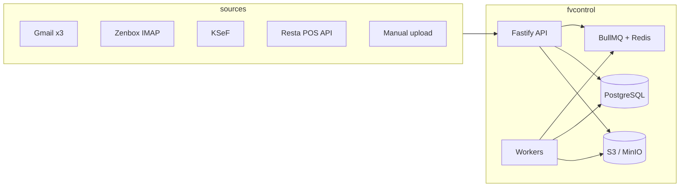

# FVControl — architecture

## Purpose

FVControl is an **AI-ready invoice operations platform**: it ingests documents from many channels, normalizes them, runs extraction and validation, scores duplicates, drives workflow states, and exposes **REST + webhooks** for automation (for example n8n). It can act as a **filter layer in front of Resta** or as a **standalone web app** (UI in this repo consumes the same API).

## High-level layout

## Modular boundaries (clean-ish)

| Layer | Responsibility |
|--------|----------------|
| **domain** | Pure rules: fingerprint, duplicate scoring, validation helpers |
| **modules** (`services`) | Use-cases: invoices, ingestion, pipeline, deduplication, dashboard |
| **repositories** | Prisma access stays in services today; split further when modules grow |
| **adapters** | Storage (local/S3), AI (mock/real), external APIs |
| **connectors** | Gmail, IMAP, KSeF, Resta — **interfaces + stubs**; implementations per rollout phase |
| **jobs/workers** | Async pipeline execution, retries, DLQ semantics |

## HTTP surface

- **API prefix:** `/api/v1`
- **OpenAPI:** `/docs` (Swagger UI)
- **Plan wdrożenia integracji (mail → FV, n8n, OpenClaw, KSeF):** [integration-deployment-plan.md](./integration-deployment-plan.md)
- **OpenClaw (Discord) + n8n:** [openclaw-n8n-hybrid.md](./openclaw-n8n-hybrid.md)
- **Liveness:** `GET /api/v1/health`
- **Readiness:** `GET /api/v1/ready` (Postgres + Redis)
- **Metrics:** `GET /metrics` (Prometheus)

## Pipeline (idempotent steps, retries)

1. **INGEST** — channel-specific (upload already created `Document` + stub `Invoice`)
2. **PERSIST_RAW** — object storage write (done on upload for manual path)
3. **PARSE_METADATA** — headers / MIME (extensible)
4. **EXTRACT** — `AiInvoiceAdapter` (mock behind `FEATURE_AI_EXTRACTION_MOCK`)
5. **VALIDATE** — schema + business rules
6. **DEDUP** — fingerprint + fuzzy pair scoring → `invoice_duplicates`
7. **CLASSIFY** — status (`RECEIVED`, `PENDING_REVIEW`, …)
8. **EMIT_EVENTS** — `webhooks_outbox` row (delivery worker can be added)
9. **AUDIT** — `audit_logs`

Failures increment BullMQ attempts; after max attempts the worker marks `processing_jobs.status = DEAD_LETTER` and invoice `FAILED_NEEDS_REVIEW`.

## Security model (current)

- **JWT** access + **opaque refresh** with rotation (existing auth module)
- **Argon2** passwords
- **AES-256-GCM** for integration secrets (`ENCRYPTION_KEY`)
- **RBAC tables** (`roles`, `permissions`, `role_permissions`, `user_roles`) seeded; route guards still use legacy `User.role` enum for speed — extend `authenticate` to enforce permission keys next
- **Helmet**, **CORS allowlist**, **rate limit** on login and inbound webhooks
- **Structured logs** with `x-request-id` and redacted sensitive headers

## Rollout phases (summary)

| Phase | Scope |
|-------|--------|
| **1** | Core API, manual upload, pipeline skeleton, dedupe, dashboard KPIs |
| **2** | Gmail OAuth + history sync; Zenbox IMAP IDLE/poll |
| **3** | KSeF fetch + mapping; Resta POS read connector |
| **4** | Real AI adapters, anomaly workflows, auto-resolution rules |

(See [rollout.md](./rollout.md) for detail.)

## Implemented reliability extras

- **`Idempotency-Key`** on selected **POST/PATCH** routes (after `authenticate`):
  - DB unique key `(tenantId, idempotency_key, route_fingerprint)` with **transaction + `pg_advisory_xact_lock`** so concurrent requests with the same key cannot create two resources.
  - Rows use lifecycle **`IN_FLIGHT`** until a **2xx** response is persisted as **`COMPLETED`**; non-2xx and thrown errors clear the in-flight row.
  - Request fingerprint uses **stable JSON** key ordering plus method + route pattern + params (`buildIdempotencyRouteKey`).
  - TTL `IDEMPOTENCY_TTL_HOURS`; expired rows removed by worker **housekeeping**; metrics `fvcontrol_idempotency_replay_total`, `fvcontrol_idempotency_conflict_total`, `fvcontrol_idempotency_stored_total`, `fvcontrol_idempotency_keys_active`, `fvcontrol_cleanup_deleted_total{entity="idempotency"}`.
- **Outbound webhooks:** `npm run worker` sweeps `webhooks_outbox` on `WEBHOOK_DELIVERY_INTERVAL_MS`.
  - States: **`PENDING` → `PROCESSING` → `SENT`**, or **`FAILED_RETRYABLE`** with backoff, then **`DEAD_LETTER`** after `WEBHOOK_DELIVERY_MAX_ATTEMPTS`.
  - Signing: **`X-FVControl-Signature: sha256=<hex>`**, **`X-FVControl-Timestamp`** (Unix seconds), **`X-FVControl-Delivery-Id`**, **`X-FVControl-Event`**, **`X-FVControl-Delivery-Attempt`** (optional); message = **`${timestamp}.${rawBody}`** where `rawBody` is the exact UTF-8 POST body (canonical JSON of payload) (see [security-hardening.md](./security-hardening.md)).
  - Stale **`PROCESSING`** rows are reclaimed to **`FAILED_RETRYABLE`** after `WEBHOOK_PROCESSING_STALE_MS`.
  - Metrics: `fvcontrol_webhook_delivery_total{status=…}`, `fvcontrol_webhook_dead_letter_total`, `fvcontrol_webhook_delivery_duration_seconds`, `fvcontrol_cleanup_deleted_total{entity="webhook"}` (old **`SENT`** rows past retention).
- **Admin:** `POST /api/v1/admin/webhooks/:deliveryId/retry`, `GET /api/v1/admin/webhooks/dlq` (pagination + `eventType` filter).
- **Invoice compliance / KSeF filter (legal channel separation):**
  - Extended `Invoice` with `intake_source_type`, `document_kind`, `legal_channel`, `ksef_*`, `review_status`, `accounting_status`, payloads, `compliance_flags` (see [compliance-rules.md](./compliance-rules.md)).
  - Tables `invoice_sources`, `invoice_compliance_events`, `accounting_exports`.
  - Rules engine in `src/modules/compliance/`; pipeline step **`COMPLIANCE`** after OCR/dedupe.
  - API: `POST /invoices/intake`, `POST /invoices/:id/classify`, `validate-compliance`, `send-to-ksef` (stub), list filters, `POST /accounting/export-batch`.
  - **No auto-legalization** of email/OCR documents as KSeF; KSeF API path is structured truth; own sales = KSeF-first (`TO_ISSUE`).

## Known gaps (intentional next steps)

- **Gmail Pub/Sub** push: interface only; polling/sync worker first.
- **Permission-based** `preHandler` instead of only `User.role` checks.
- **Multipart uploads** (`manual-upload`, invoice file POST) do not use `Idempotency-Key` hashing (body not stable JSON).
